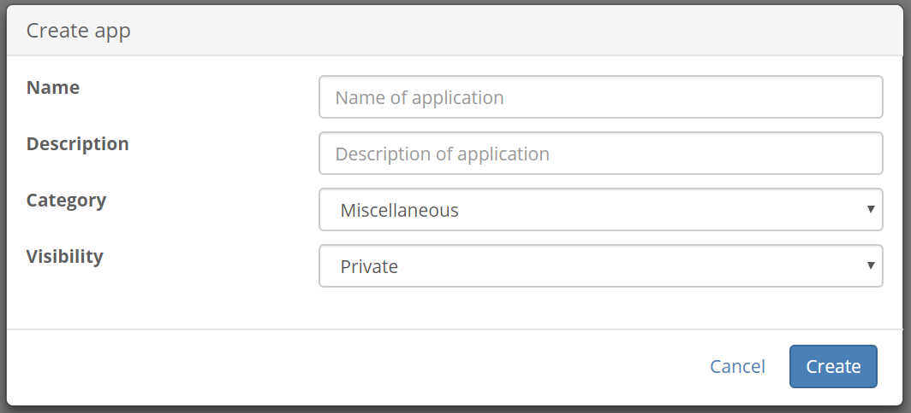
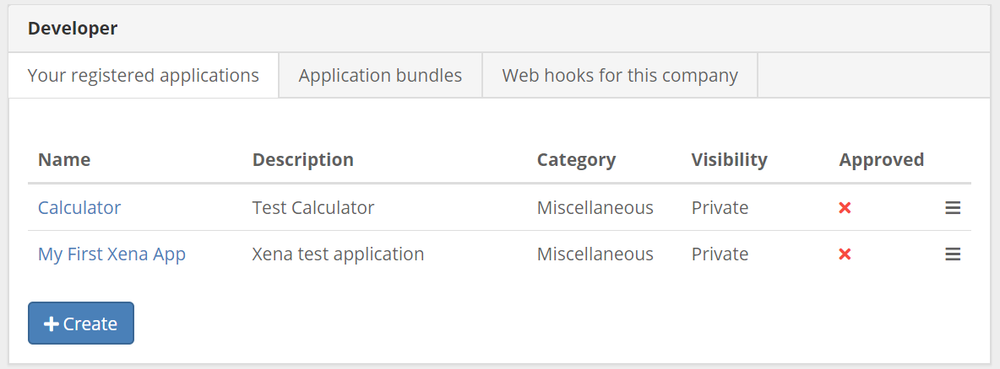
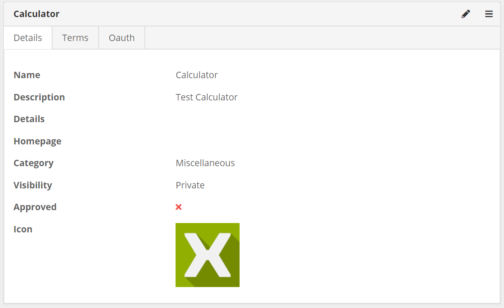

## Developer menu

Once you have installed the Xena developer app you should now see the Udvikler menu under app store.   Select the udvilker menu item now.

## registering an application 

If you are creating an application for use with Xena you will need to register that application.  There are sevral reasons why you need to do this.

- We need to know who has applications running in xena. 
- We need to be able to contact you if we are making changes to the Xena api that may effect your application.
- We need to contact you if there are any issues with your application.
- If you need autnecation credetnails they need to be linked to your app.

### Creating an application

Click the create button to create your first Xena applicaiton.

Fill in the form with the name and a short description of your application.  This information will help to infom potential users about what they can expect from your application.

You can also pick a category for your application so that we know where to display it in the app store.

- Webshop
- Reporting
- Credit Rating
- Miscellanious

Visibility allows you to decide.  If other users should be able to see your app? 

| Visibility          | Meaning |
| -------------  | ------------- |
| Public        | Everybody can see and use your app.   |
| Private        | Only fiscalsetups where you have a membership can see and use this app.  |
| Internal          | Only the current fiscalsetup can see and use this app.  |

### List of your applications

You should now see a list of your applications.  Click on the name of your applicaton to see its details.

## Application detials

There are two sections to the application details page.  The first is the basic details of your applcation allowing you to edit this information.  The second tab allows you to set up some terms of use for your applcation which users will be presented with the first time they login to your application.   The last tab is the oauth tab where you set up your client credetials if you will be using the Xena api.

The second section to the application details allows you to set a price for your applcaiton.  Set it up to run as a plugin in xena and lets you see who has installed your application.

