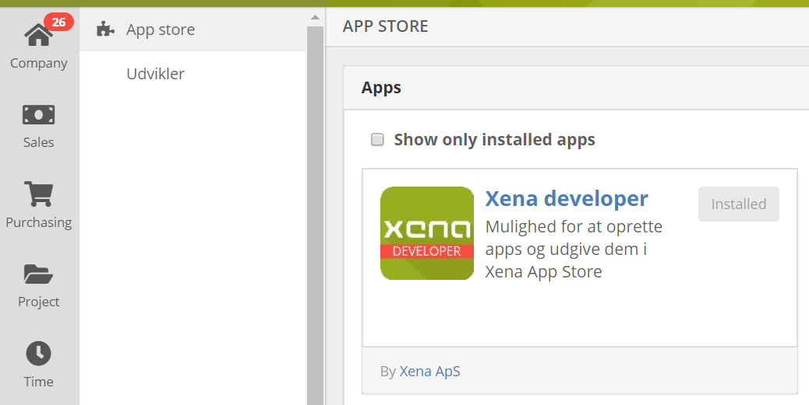

## Installing the Xena Developer console

Login to xena in in the company which you would like to create your application.  In the left hand menu fild Apps then select app store. Once you are within the app store you will find a number of first party and third party applications that you can install into Xena.  Find Xena developer and install it.

## Developer menu

Once you have installed the Xena developer app you should now see the Udvikler menu under app store.   Select the udvilker menu item now.

