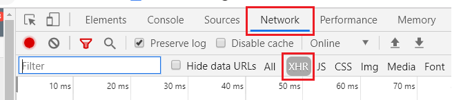

# Xena APIs

Xena is divided into diffrent APIs.

| Name | Description | Support API keys |
| :--- | :--- | :--- |
| Xena | The Old core API of Xena. Contains all of the core ERP functions | Yes |
| Cars (Giulia) | All function relation to handling cars | No |
| Cars (Giulia) | All function relation to handling cars | No |
| Cars (Giulia) | All function relation to handling cars | No |
| Cars (Giulia) | All function relation to handling cars | No |
| Cars (Giulia) | All function relation to handling cars | No |

## How to find the right API to use

1. Find the page in Xena with the info you need.
2. Open the developer tools in your browser (F12 i Chrome)
3. Find the network tab and activate the XHR filter
4. Refresh the page (F5)
5. Now you an see all the requests out client makes to the different API.

