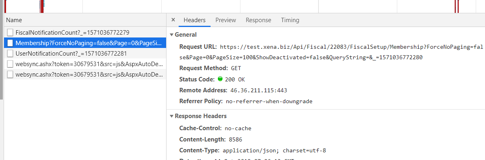

# Xena APIs

WPI

Xena is divided into diffrent APIs.

| Name | Description | Support API keys |
| :--- | :--- | :--- |
| Xena | The Old core API of Xena. Contains all of the core ERP functions | Yes |
| Cars (Giulia) | All function relation to handling cars | No |
| Cars (Giulia) | All function relation to handling cars | No |
| Cars (Giulia) | All function relation to handling cars | No |
| Cars (Giulia) | All function relation to handling cars | No |
| Cars (Giulia) | All function relation to handling cars | No |

## How to find the needed API 
The easiest way to find the needed API is to looking at how the Xena client gets information. You can do that with the developer tools in your own browser.

1. Find the page in Xena with the info you need.
2. Open the developer tools in your browser (F12 in Chrome)
3. Find the network tab and activate the XHR filter

4. Refresh the page (F5)
5. Now you an see all the requests our client makes to the different API.

You can ignore websync and FiscalNotificationCount.
