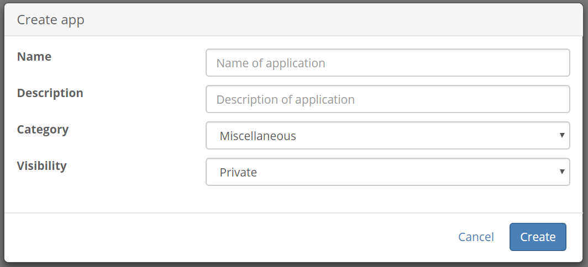
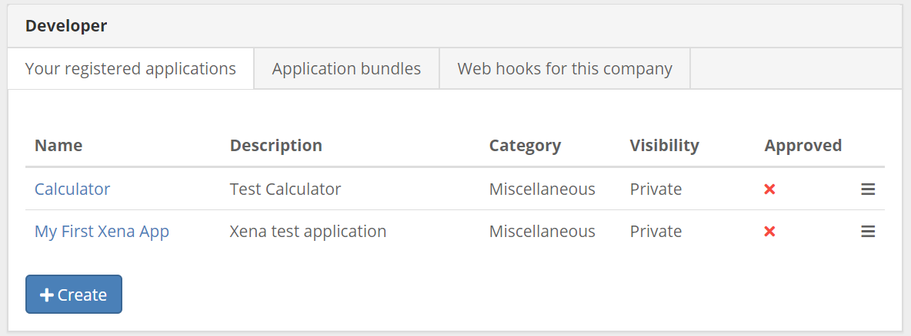
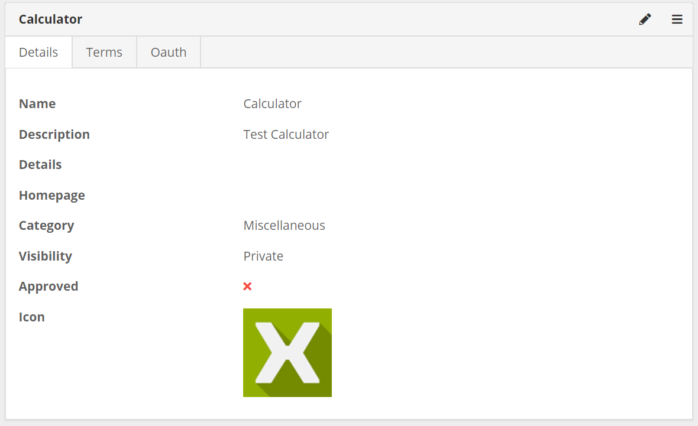
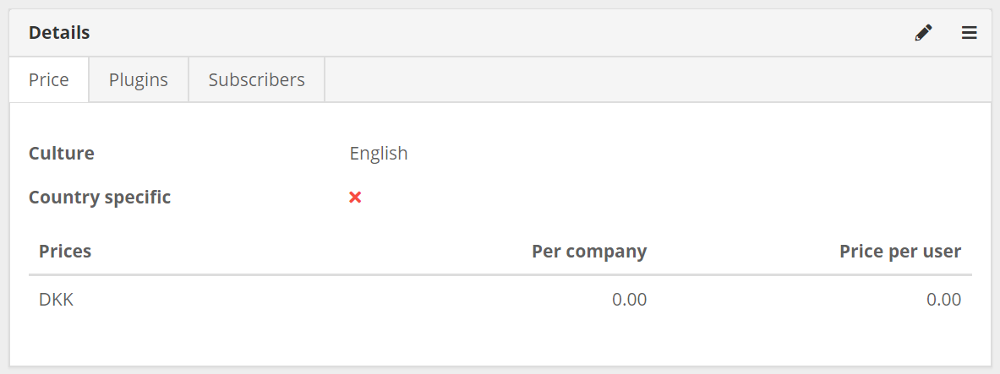

# Register your app

Once you have [installed the Xena Developer app](installxenadeveloper.md) you can go to APPS &gt; DEVELOPER in the main menu. Here you will get a list of all the apps in the fiscal setup. If this is your first app this list will be empty.

To create an application for use in Xena you will need to register it. Registering your app ensures that ...

* We know who has applications running in Xena. 
* We can contact you if we are making changes to the Xena API that may effect your application.
* We can contact you if there are any issues with your application.
* You can get authentication credentials, if needed in your app.

## Application registration

1. Go to APPS &gt; DEVELOPER.
2. Click the "create" button to start the registration.

3. Fill in the form with the **name** and a **short description** of your application. This information will help to inform potential users about what they can expect from your application.

You can also pick a **category** for your application so that we know where to display it in the app store.

* Webshop
* Reporting
* Credit Rating
* Miscellanious

**Visibility** allows you to decide if other users should be able to see your app.

| Visibility | Meaning |
| :--- | :--- |
| Public | Everybody can see and use your app. |
| Private | Only fiscalsetups where you have a membership can see and use this app. |
| Internal | Only the current fiscalsetup can see and use this app. |

## List of your applications

You should now see a list of your applications. Click on the name of your application to see its details.

## Application details

There are different sections on the application details page. The first contains the following tabs:

* "Details" is basic information about your app and allow you to edit this information.
* "Terms" allows you to set up terms of use for your applcation which users will be presented with the first time they login to your application.
* "OAuth" is where you set up your client credentials if you will be using the Xena API. This tab is only available if the app "Xena Developer Console" is installed.

The second section on the application details page contains:

* "Price" allows you to set a price for your application.
* "Plugins" is where you can add your app to the Xena UI. See this page describing [the possibilities](../../the-possibilities/). 
* "Subscribers" is a list of fiscals who have installed your app.
* "Preview" is how your app will be presented in our app store.

Finally, the third section is for handling approvals for your app. Here you can submit or remove your app from our app store and you can follow the approval status.

