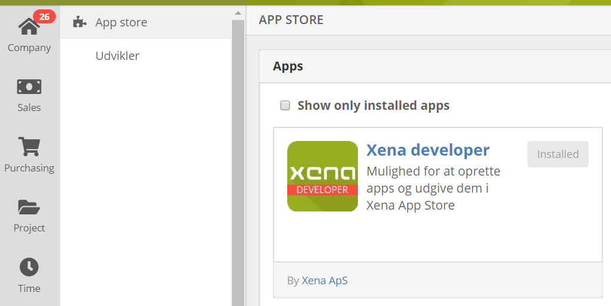

# Become a developer

1. Login to Xena in in the fiscal which you would like to create your application.
2. In the main menu, go to APPS &gt; APP STORE.
3. Find the app "Xena Developer" and install it. This will allow you to submit and register apps. 

If you want your app connected to Xena Identity Server \(OAuth\) you will also need the “Xena Developer Console” app.

The installed apps are available in the underneath the App store menu item.

