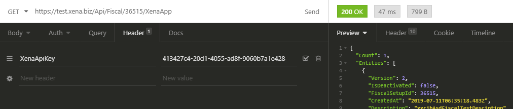

# Using Xena API Key

## Creating Xena API keys

After you login, enter the Company tab -&gt; API-keys


To get your api key you have to get premium subscription.


## API call

To call the Xena API you need a header called `XenaApiKey: [KEY]` and that's it.

