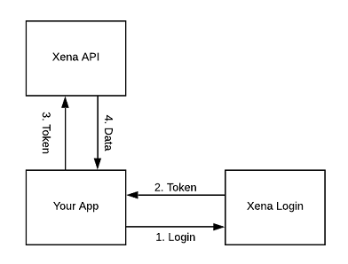
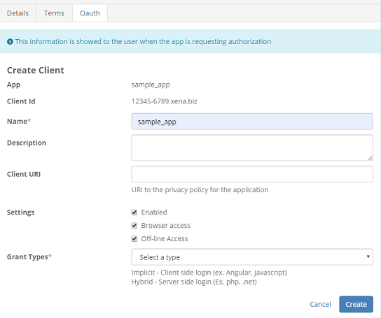
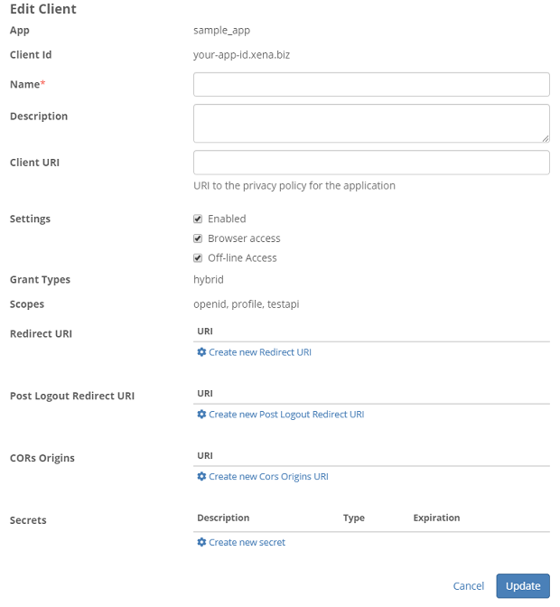

## Using Xena API

The baisc flow looks like this: 

1. User enters your app.
2. The user encounters a place in your application where he want to use Xena API.
3. He will be forced to login into the Xena.
4. After successfull login he will be transfered back to your app with tokens.
5. Your app can communicate with the Xena Api by passing the users access_token.

> See our [github samples here](https://github.com/EG-BRS/Identity.Server.Sample.Dotnet).  
For more see [Identity Server sample clients](https://github.com/IdentityServer/IdentityServer4/tree/master/samples/Clients/src).

## Creation
Firstly your app needs to be [registred](createapplication.md) in xena then in OAuth tab:

> You won't be able to change the grant type later on

**Client Id** - Unchangeable id that your app will be recognized in xena (whole string with .xena.biz).   
**Name** - Your app name that will be shown to the user in consent screen.    
**Client Uri** - link to your terms of service and privacy policy during user login.  

Settings:
- Enabled - you can enable/disable your connection with the app.
- Browser access - allows obtaining the access_token through front channel communication.
- Off-line access - Used in hybrid flow to obtain refresh_token that can be exchanged for access_token without user interaction.

Supported grant types:
- Implicit - mainly for browser-based applications.
- Hybrid - for applications with backend where the server will communicate with the xena api.

### Configuration

After the client creation you will be transfered to edit window with few new settings:

- Scopes - Available scopes for your app. The **testapi** scope is required for [**Xena API**](the-xena-api.md) communication.
- RedirectUri - The uri of your oidc login endpoint. These **must match** in client and configuration. (For ASP default path is yourapp.com/signin-oidc)
- Post Logout Redirect Uri - After the user logs out, he will be transfered back to your app. (For ASP default path is yourapp.com/signout-callback-oidc)
- Secrets - auto-generated secret for your app (hybrid flow)