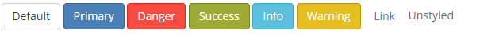
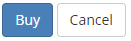
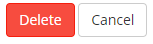
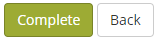
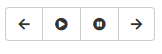
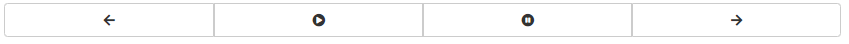

# Buttons

Available button styles:



Please note:

* We do not use the `btn-info` and `btn-warning` unless it really make sense in a specific case.
* `btn-primary` should only be used once in every view, if possible. 
* All the `btn` classes can be used on both `a` and `button` elements.



Examples:



```markup
<button class="btn btn-primary">Buy</button>
<button class="btn btn-default">Cancel</button>
```



```markup
<button class="btn btn-danger">Delete</button>
<button class="btn btn-default">Cancel</button>
```



```markup
<button class="btn btn-success">Complete</button>
<button class="btn btn-default">Back</button>
```

## Button group



```markup
 <div class="btn-group">
    <button class="btn btn-default"><i class="icon-backward"></i></button>
    <button class="btn btn-default"><i class="icon-play"></i></button>
    <button class="btn btn-default"><i class="icon-pause"></i></button>
    <button class="btn btn-default"><i class="icon-forward"></i></button>
</div>
```

## Justified button group:



```markup
<div class="btn-group btn-group-justified">
    <div class="btn-group">
        <button class="btn btn-default"><i class="icon-backward"></i></button>
    </div>
    <div class="btn-group">
        <button class="btn btn-default"><i class="icon-play"></i></button>
    </div>
    <div class="btn-group">
        <button class="btn btn-default"><i class="icon-pause"></i></button>
    </div>
    <div class="btn-group">
        <button class="btn btn-default"><i class="icon-forward"></i></button>
    </div>
</div>
```

Same effect with `a` elements:

```markup
<div class="btn-group btn-group-justified">
    <a href="#" class="btn btn-default"><i class="icon-backward"></i></a>
    ...
</div>
```

