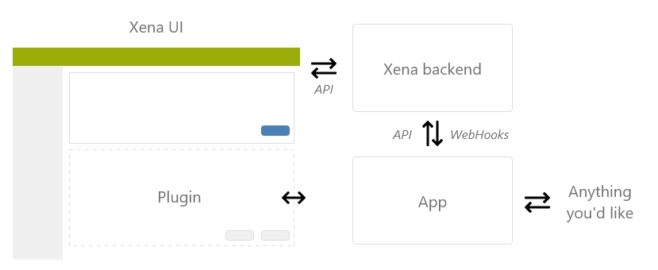

# The possibilities

An integration can use any of these three types alone or in any combination desired for the specific integration. To give an idea to how Xena works behind the scenes, have a look at this diagram:

Here there are three major parts:

* **Xena UI**  The user interface which is found on my.xena.biz and where all the user interaction happens. Inside the Xena UI an app can create “plugins”, these plugins can be widgets, extra tabs, buttons, context menus etc.
* **Xena backend** 
   The backend contains all business logic and is also the datastore for Xena. The backend exposes an API which the Xena UI communicates with, this is the same API which any App should interact with to get or change data inside Xena. The backend also contains a webhook engine which can notify external parts whenever something inside the Xena datastore changes.
* **Third party App** 
   This is the final piece of the puzzle, custom applications built by third party developers like yourself.

