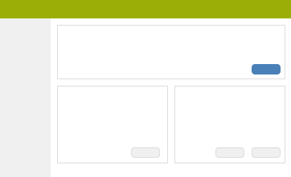
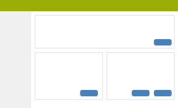
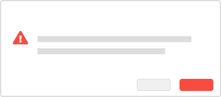
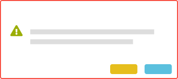

# User experience

Using Bootstrap – or any other design framework – help styling components quickly and consistently. But it is not a user experience framework. The following will help you use the provided design to create a good user experience in Xena.

### Primary action

There can be many buttons and links in a view, but only one primary action.

|   |   |
| :--- | :--- |
| **DO:** Clearly highlight the primary action the user can perform. All other buttons are not as important. | **DON'T:** Do not give every button the styling for a primary button.
 |

### 
Colors for buttons and alerts

For most part, only the default styling and the primary button styling is needed. However, careful use of colors can in some cases communicate urgency or importance to the user.

|   |   |
| :--- | :--- |
| **DO:** Use "danger" colors when performing a delete action or something an action failed. Use "success" colors when a job or action was completed successfully. | **DON'T:** Do not use different colors for the sake of decoration.

 |

### Accessible on all devices

Xena is available on computers, tablets and smartphones. It can be a challenge to accommodate much information on a small screen. Take this into consideration when you design your app, plugin or integration.

|  |  |
| :--- | :--- |
| **DO:** Make views and actions accessible to users using their fingers and users with mouse and keyboard.
 | **DON'T:** Do not make the UI dependent on hovering.
 |

