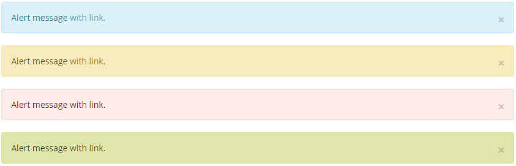
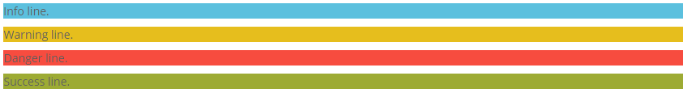
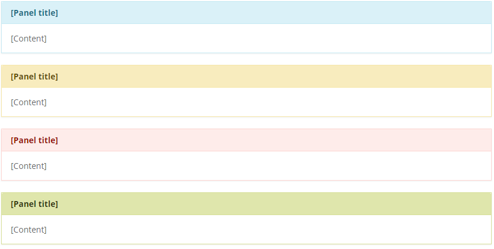

# Alerts and warnings

We operate with four types of information: Info, Warning, Danger and Success. Here they are represented in alerts:



```markup
<div class="alert alert-info">
    <button type="button" class="close"><i class="icon-close"></i></button>
    <p>Alert message <a href="#" class="alert-link">with link</a>.</p>
</div>
<div class="alert alert-warning">
    <button type="button" class="close"><i class="icon-close"></i></button>
    <p>Alert message <a href="#" class="alert-link">with link</a>.</p>
</div>
<div class="alert alert-danger">
    <button type="button" class="close"><i class="icon-close"></i></button>
    <p>Alert message <a href="#" class="alert-link">with link</a>.</p>
</div>
<div class="alert alert-success">
    <button type="button" class="close"><i class="icon-close"></i></button>
    <p>Alert message <a href="#" class="alert-link">with link</a>.</p>
</div>
```

Here they are represented in font color:


```markup
<p class="text-info">Info text.</p>
<p class="text-warning">Warning text.</p>
<p class="text-danger">Danger text.</p>
<p class="text-success">Success text.</p>
```

Here they are represented in background color on lines:



```markup
<p class="bg-info">Info line.</p>
<p class="bg-warning">Warning line.</p>
<p class="bg-danger">Danger line.</p>
<p class="bg-success">Success line.</p>
```

Also panels can represent these types:



```markup
<section class="panel panel-info">
    <header class="panel-heading">
        <h2 class="panel-title">[Panel title]</h2>
    </header>
    <div class="panel-body">
        [Content]
    </div>
</section>
<section class="panel panel-warning">
    ...
</section>
<section class="panel panel-danger">
    ...
</section>
<section class="panel panel-success">
    ...
</section>
```

