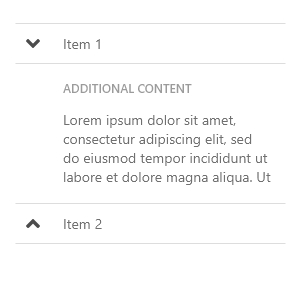
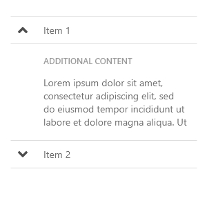

# Collapsible

Collapsible content is often found in tables. By expanding or collapsing an element the user has easy access to additional information without leaving the current view.

### Using icons

An icon is often used on the button to expand or collapse an element. The icon should point in the direction of the action; it should not illustrate the current state. E.g. if you were to swap the icon with text it should say "Expand" when collapsed and "Collapse" when expanded.

| 🚫 Don't | ✔  Do |
| :--- | :--- |
|   |   |
| The icon points in the wrong direction of what will happen. | The icon illustrates what will happen when clicking on it. |

If a large number of lines are expandable, you can provide a button to expand/collapse all items at once.

