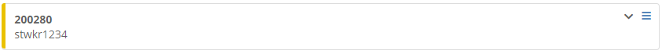
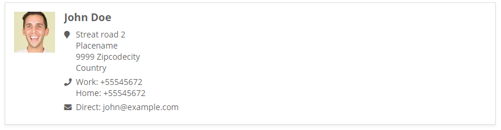
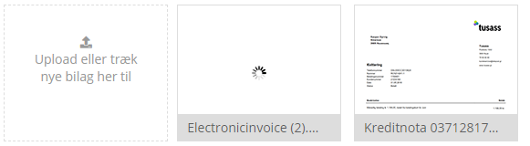

# Other components

## Cards

Cards \(not the same as panels\) are used to contain data. Especially used in Status overviews.

### Standard cards



```markup
<div class="card card-default">
    <ul class="card-menu">
        ...
    </ul>
    <div class="card-color-label" style="background-color: rgb(234, 193, 0);"></div>
    <div class="card-body">
        <strong><a href="#">200280</a></strong><br>
        <a href="#">stwkr1234</a>
        <div class="card-infobox" style="display: none;">
            <div>Adresse</div>
            <div>Stednavn</div>
            <div>
                <span>9999</span>
                <span>By</span>
            </div>
            <br>
            <div></div>
        </div>
    </div>
</div>
```

### Fiscal cards

Cards are also used to list fiscals.


```markup
<div class="card-deck-wrapper">
    <div class="card-deck">
        <div class="card card-default card-inverted">
            <a class="card-img-top" href="#">
                
            </a>
            <div class="color-preview-bar theme-default-preview"></div>
            <div class="card-body">
                <p class="card-title no-margin"><a href="#">Fiscal name</a></p>
                <p class="card-text text-muted"><small>Administrator</small></p>
            </div>
        </div>
    </div>
</div>
```

## vCards

vCards is a digital contact card. Visually we try to illustrate that.



```markup
<div class="vcard">
    <div class="vcard-image">
        
    </div>
    <div class="vcard-body">
        <h4 class="vcard-heading">John Doe</h4>
        <div class="vcard-data">
            <div class="vcard-data-icon"><i class="icon-place"></i></div>
            <div>Streat road 2</div>
            <div>Placename</div>
            <div>
                <span>9999</span>
                <span>Zipcodecity</span>
            </div>
            <div>Country</div>
        </div>
        <div class="vcard-data">
            <div class="vcard-data-icon"><i class="icon-phone"></i></div>
            <div>
                <span>Work: </span>
                <a class="link-muted" href="tel:+55545672">+55545672</a>
            </div>
            <div>
                <span>Home: </span>
                <a class="link-muted" href="tel:+55545672">+55545672</a>
            </div>
        </div>
        <div class="vcard-data">
            <div class="vcard-data-icon"><i class="icon-email"></i></div>
            <div>
                <span>Direct: </span>
                <a class="link-muted" href="mailto:john@example.com">john@example.com</a>
            </div>
        </div>
    </div>
</div>
```

## Files overview, file slider \(deprecated\)

Used in list of vouchers and files with preview. The list scrolls horizontally. The following demo shows a container used for “dropzone”, a preview loading and a regular file preview.



```markup
<div class="file-slider">
    <div class="file-container dropzone-item">
        <div class="text-muted text-center">
            <div><span class="icon-upload"></span></div>
            <div>Upload eller træk nye bilag her til</div>
        </div>
    </div>
    <div class="file-container">
        <div class="file-preview">
            <div style="display: none;"></div>
            <div class="preview-loading" title="Henter..."></div>
        </div>
        <div class="file-text">Electronicinvoice (2).xml</div>
        <div class="file-actions"><span class="icon-delete"></span></div>
    </div>
    <div class="file-container">
        <div class="file-preview">
            <div></div>
            <div class="preview-loading" title="Henter..." style="display: none;"></div>
        </div>
        <div class="file-text">Kreditnota 037128175 fra Bygma Aabenraa.xml</div>
        <div class="file-actions"><span class="icon-delete"></span></div>
    </div>
</div>
```

