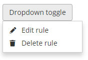
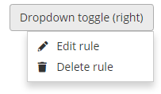

# Dropdowns

Standard dropdown:



```markup
<div class="dropdown">
    <button class="btn btn-default dropdown-toggle" data-toggle="dropdown" aria-expanded="false">Dropdown toggle</button>
    <ul class="dropdown-menu">
        <li><a href="#"><i class="icon-edit"></i> Edit rule</a></li>
        <li><a href="#"><i class="icon-delete"></i> Delete rule</a></li>
    </ul>
</div>
```

If using in the right side of the screen, add `dropdown-menu-right`:

```markup
 <div class="dropdown">
    <button class="btn btn-default dropdown-toggle" data-toggle="dropdown" aria-expanded="false">Dropdown toggle (right)</button>
    <ul class="dropdown-menu dropdown-menu-right">
        <li><a href="#"><i class="icon-edit"></i> Edit rule</a></li>
        <li><a href="#"><i class="icon-delete"></i> Delete rule</a></li>
    </ul>
</div>
```



