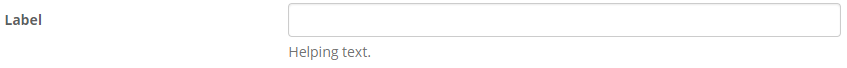
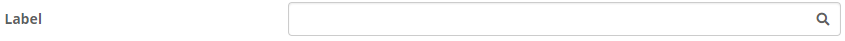
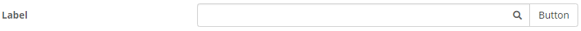
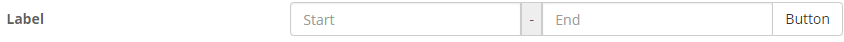
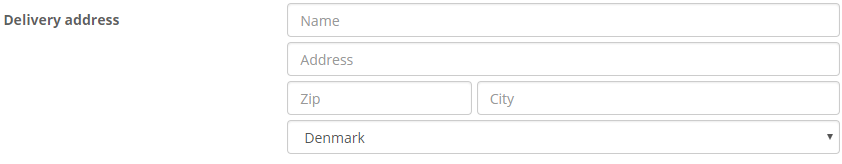
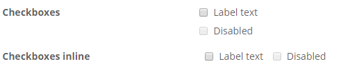
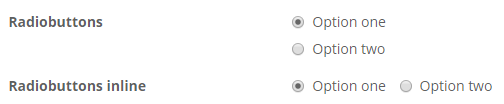

# Forms

Most features in Xena rely on user input. The most used layout for forms in Xena is the form-horizontal. Please note the classes to make the form responsive.

## Label



```markup
<div class="form-horizontal">
    <div class="form-group">
        <div class="col-xs-12 col-sm-4"><label class="control-label" for="input1">Label</label></div>
        <div class="col-xs-12 col-sm-8">
            <input type="text" class="form-control" id="input1">
            <p class="help-block">Helping text.</p>
        </div>
    </div>
</div>
```

Form input with an **illustrative icon**.



```markup
 <div class="form-horizontal">
    <div class="form-group">
        <div class="col-xs-12 col-sm-4"><label class="control-label" for="input2">Label</label></div>
        <div class="col-xs-12 col-sm-8">
            <div class="input-icon-group">
                <input type="text" class="form-control" id="input2">
                <span class="input-icon"><i class="fas fa-search"></i></span>
            </div>
        </div>
    </div>
</div>
```

Form input with an illustrative icon and **link add-on**.


```markup
<div class="form-horizontal">
    <div class="form-group">
        <div class="col-xs-12 col-sm-4"><label class="control-label" for="input3">Label</label></div>
        <div class="col-xs-12 col-sm-8">
            <div class="input-group">
                <input type="text" class="form-control" id="input3">
                <span class="input-icon"><i class="fas fa-search"></i></span>
                <a href="#" class="input-group-addon"><i class="fas fa-plus"></i></a>
            </div>
        </div>
    </div>
</div>
```

Form input with an illustrative icon and **button add-on**.



```markup
 <div class="form-horizontal">
    <div class="form-group">
        <div class="col-xs-12 col-sm-4"><label class="control-label" for="input4">Label</label></div>
        <div class="col-xs-12 col-sm-8">
            <div class="input-group">
                <input type="text" class="form-control" id="input4">
                <span class="input-icon"><i class="fas fa-search"></i></span>
                <div class="input-group-btn">
                    <button type="button" class="btn btn-default">Button</button>
                </div>
            </div>
        </div>
    </div>
</div>
```

The above additions can be used in different combinations.

### Input group



```markup
 <div class="form-horizontal">
    <div class="form-group">
        <div class="col-xs-12 col-sm-4"><label class="control-label" for="input10">Label</label></div>
        <div class="col-xs-12 col-sm-8">
            <div class="input-group">
                <input type="text" class="form-control" id="input10" placeholder="Start">
                <span class="input-group-addon">-</span>
                <input type="text" class="form-control" id="input11" placeholder="End">
                <div class="input-group-btn">
                    <button type="button" class="btn btn-default">Button</button>
                </div>
            </div>
        </div>
    </div>
</div>
```

### Complex forms

Some form groups contains multiple inputs, like a delivery address. Notice the following example uses form-group-multiple, input-pair and control-container to handle this situation.



```markup
<div class="form-horizontal">
    <div class="form-group form-group-multiple">
        <div class="col-xs-12 col-sm-4"><label class="control-label" for="input20">Delivery address</label></div>
        <div class="col-xs-12 col-sm-8">
            <input type="text" class="form-control" id="input20" placeholder="Name">
            <input type="text" class="form-control" id="input21" placeholder="Address">
            <div class="input-pair">
                <div class="control-container col-xs-4">
                    <input type="text" class="form-control" id="input22" placeholder="Zip">
                </div>
                <div class="control-container col-xs-8">
                    <input type="text" class="form-control" id="input23" placeholder="City">
                </div>
            </div>
            <select id="input24" class="form-control">
                <option>Denmark</option>
            </select>
        </div>
    </div>
</div>
```

Another situation: Different filers and search features. Here we often use form-inline.


```markup
<div class="form-inline">
    <div class="form-group">
        <input type="text" class="form-control" id="input30" placeholder="Search">
    </div>
    <div class="form-group">
        <select id="input31" class="form-control">
            <option>Denmark</option>
        </select>
    </div>
    <div class="checkbox">
        <label>
            <input type="checkbox"> Show disabled
        </label>
    </div>
</div>
```

### Other inputs

#### checkbox



```markup
<div class="form-horizontal">
    <div class="form-group">
        <div class="col-xs-12 col-sm-4"><label class="control-label">Checkboxes</label></div>
        <div class="col-xs-12 col-sm-8">
            <div class="checkbox">
                <label>
                    <input type="checkbox"> Label text
                </label>
            </div>
            <div class="checkbox disabled">
                <label>
                    <input type="checkbox" disabled> Disabled
                </label>
            </div>
        </div>
    </div>
    <div class="form-group">
        <div class="col-xs-12 col-sm-4"><label class="control-label">Checkboxes inline</label></div>
        <div class="col-xs-12 col-sm-8">
            <label class="checkbox-inline">
                <input type="checkbox"> Label text
            </label>
            <label class="checkbox-inline">
                <input type="checkbox" disabled> Disabled
            </label>
        </div>
    </div>
</div>
```

#### Radiobuttons



```markup
<div class="form-horizontal">
    <div class="form-group">
        <div class="col-xs-12 col-sm-4"><label class="control-label">Radiobuttons</label></div>
        <div class="col-xs-12 col-sm-8">
            <div class="radio">
                <label>
                    <input type="radio" name="optionsRadios" id="optionsRadios1" checked> Option one
                </label>
            </div>
            <div class="radio">
                <label>
                    <input type="radio" name="optionsRadios" id="optionsRadios2"> Option two
                </label>
            </div>
        </div>
    </div>
    <div class="form-group">
        <div class="col-xs-12 col-sm-4"><label class="control-label">Radiobuttons inline</label></div>
        <div class="col-xs-12 col-sm-8">
            <label class="radio-inline">
                <input type="radio" name="optionsRadios2" id="optionsRadios1" checked> Option one
            </label>
            <label class="radio-inline">
                <input type="radio" name="optionsRadios2" id="optionsRadios2"> Option two
            </label>
        </div>
    </div>
</div>
```

