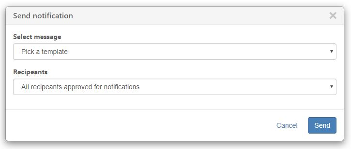

# Modals

## Standard modals

An action or feature that can be handled in a modal popup. Always provide options to cancel the action and leave the modal \(e.g. a close button in the top and a cancel button in the bottom\). Use a primary [colored button](buttons.md) to highlight the action needed.



```markup
<div class="modal" id="modalDemo1" tabindex="-1" role="dialog" aria-labelledby="modalDemo1Label">
    <div class="modal-dialog" role="document">
        <div class="modal-content">
            <div class="modal-header">
                <button type="button" class="close" data-dismiss="modal" aria-label="Close"><i class="fas fa-times"></i></button>
                <h4 class="modal-title" id="modalDemo1Label">Send notification</h4>
            </div>
            <div class="modal-body">
                ...
            </div>
            <div class="modal-footer">
                <button type="button" class="btn btn-link" data-dismiss="modal">Cancel</button>
                <button type="button" class="btn btn-primary">Send</button>
            </div>
        </div>
    </div>
</div>
```


Do not use modals for very complex tasks; they can be difficult to handle on smaller devices.


## Critical information modals

Example use case: The user initiated a delete function. You can use a modal popup to ask the user to confirm this destructive action. Use a red button to signal caution.

**SEE ALSO:** [User experience](../../the-possibilities/user-experience.md).


```markup
<div class="modal" id="modelName" tabindex="-1" role="dialog" aria-labelledby="modelNameLabel">
    <div class="modal-dialog" role="document">
        <div class="modal-content">
            <div class="modal-header">
                <button type="button" class="close" data-dismiss="modal" aria-label="Close"><i class="fas fa-times"></i></button>
                <h4 class="modal-title" id="modelNameLabel">Delete</h4>
            </div>
            <div class="modal-body">Are you sure you want to delete this?</div>
            <div class="modal-footer">
                <button type="button" class="btn btn-link" data-dismiss="modal">Cancel</button>
                <button type="button" class="btn btn-danger">Delete</button>
            </div>
        </div>
    </div>
</div>
```

## Success modals

Example use case: An action initiated by the user has completed successfully. You can use a modal popup to tell it to the user. Use a green button, or icon, to signal success.


```markup
<div class="modal" id="modalName" tabindex="-1" role="dialog" aria-labelledby="modalNameLabel">
    <div class="modal-dialog" role="document">
        <div class="modal-content">
            <div class="modal-header">
                <button type="button" class="close" data-dismiss="modal" aria-label="Close"><i class="fas fa-times"></i></button>
                <h4 class="modal-title" id="modalNameLabel">Action completed</h4>
            </div>
            <div class="modal-body text-center">
            <p><i class="fas fa-check-circle fa-3x text-success"></i></p>
            <p>The action was completed successfully.</p></div>
            <div class="modal-footer">
                <button type="button" class="btn btn-success" data-dismiss="modal">Okay</button>
            </div>
        </div>
    </div>
</div>
```

