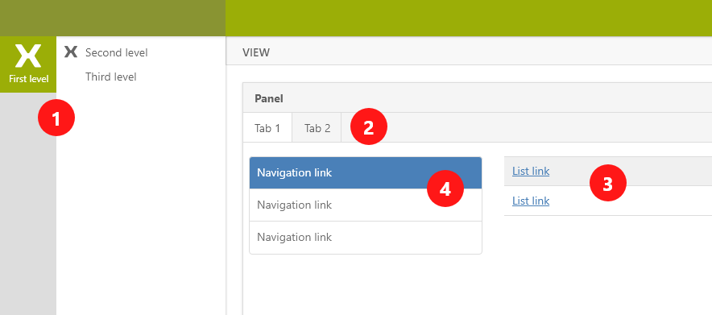

# Navigation

The primary navigation is, of cause, the main menu with its second level navigation \(1\). Another common navigation is lists in views \(2\) and tabs in top of panels \(3\). If beneficial for the end user, you can also have navigation inside a panel \(4\).

<table>
  <thead>
    <tr>
      <th style="text-align:left">Area</th>
      <th style="text-align:left">Description</th>
    </tr>
  </thead>
  <tbody>
    <tr>
      <td style="text-align:left">Main menu, first level (1)</td>
      <td style="text-align:left">This is for main sections (not individual views) and groups multiple related
        views/apps. This menu item has an icon.</td>
    </tr>
    <tr>
      <td style="text-align:left">Main menu, second level (1)</td>
      <td style="text-align:left">This is the sub sections or specific views of the first level main menu.
        This menu item has an icon.</td>
    </tr>
    <tr>
      <td style="text-align:left">Main menu, third level (1)</td>
      <td style="text-align:left">The is more rarely used but can be efficient for providing a kind of shortcut
        to functions or &quot;latest used&quot; items. This menu item has no icon.</td>
    </tr>
    <tr>
      <td style="text-align:left">Tabs (2)</td>
      <td style="text-align:left">This is for shifting between content in the same panel. Has no icon.</td>
    </tr>
    <tr>
      <td style="text-align:left">Lists (3)</td>
      <td style="text-align:left">
        
Often presented in tables with links. This guides the user to items or
          other areas in the application. Most often this have no icon.
           
        

        
Can also be used as a &quot;split view&quot; navigation, where clicking
          the link will present new content on a part of the page.
           
        

      </td>
    </tr>
    <tr>
      <td style="text-align:left">Navigation panel (4)</td>
      <td style="text-align:left">Be cautious &#x2013; making too much navigation, can be confusing to the
        end user. Less is more. However, a navigation panel inside a pane gives
        room more options.</td>
    </tr>
  </tbody>
</table>