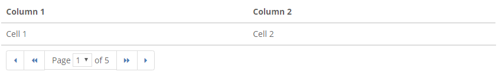
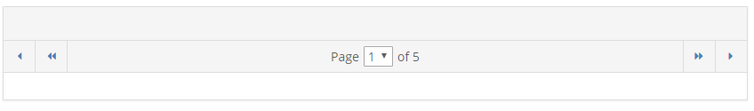

# Pagination

## Tables/pages



```markup
<div class="table-footer">
    <ul class="pagination">
        <li><a href="#" title="First"><i class="icon-caret-left"></i></a></li>
        <li><a href="#" title="Previous"><i class="icon-caret-left"></i><i class="icon-caret-left"></i></a></li>
        <li class="pagination-select">Page <select class="paging-select"><option>1</option> ... </select> of 5</li>
        <li><a href="#" title="Next"><i class="icon-caret-right"></i><i class="icon-caret-right"></i></a></li>
        <li><a href="#" title="Last"><i class="icon-caret-right"></i></a></li>
    </ul>
</div>
```

## Panels



```markup
<!--Between panel-heading and panel-body-->
<ul class="panel-pagination">
    <li>
        <a href="#" title="First"><i class="icon-caret-left"></i></a>
        <a href="#" title="Previous"><i class="icon-caret-left"></i><i class="icon-caret-left"></i></a>
    </li>
    <li class="pagination-select">Page <select class="paging-select"><option>1</option> ... </select> of 5</li>
    <li>
        <a href="#" title="Next"><i class="icon-caret-right"></i><i class="icon-caret-right"></i></a>
        <a href="#" title="Last"><i class="icon-caret-right"></i></a>
    </li>
</ul>
```

