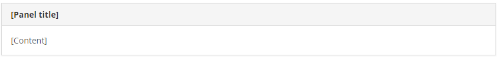
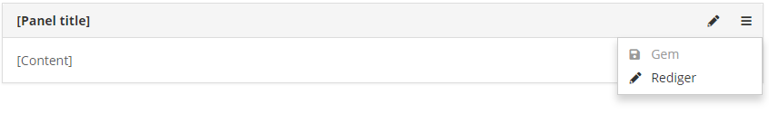
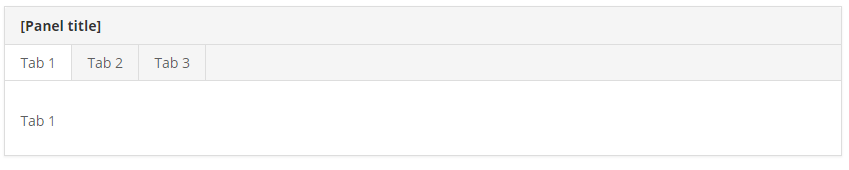
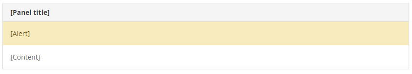

# Panels

## When to use panels

* If you are creating a **simple plugin** you may not need panels but should just create a webpage with no "chrome", making use of the whole width.
* If you are creating a **new view** for Xena, like a dashboard, you should create your own panels.

## Basic

A panel is a section with header and div elements.



```markup
<section class="panel panel-default">
    <header class="panel-heading">
        <h2 class="panel-title">[Panel title]</h2>
    </header>
    <div class="panel-body">
        [Content]
    </div>
</section>
```

## Context menu

A panel can have a context menu in the header along with shortcut buttons.



```markup
<section class="panel panel-default">
    <header class="panel-heading">
        <h2 class="panel-title">[Panel title]</h2>
        <ul class="panel-menu">
            <li><a href="#" title="Rediger" class="toggle-editform"><span class="fas fa-edit"></span></a></li>
            <li><a href="#" class="dropdown-toggle" data-toggle="dropdown" title="Funktioner"><i class="fas fa-ellipsis-h"></i></a>
                <ul class="dropdown-menu dropdown-menu-right">
                    <li class="disabled"><a href="#"><i class="fas fa-save"></i> Gem</a></li>
                    <li><a href="#" class="toggle-editform"><i class="fas fa-edit"></i> Rediger</a></li>
                </ul>
            </li>
        </ul>
    </header>
    <div class="panel-body">
        [Content]
    </div>
</section>
```

## Tabs

The content of a panel can be divided in tabs.



```markup
<section class="panel panel-default">
    <header class="panel-heading">
        <h2 class="panel-title">[Panel title]</h2>
    </header>
    <div class="panel-tabs">
        <ul>
            <li class="active"><a href="#tab1" data-toggle="tab">Den første lange 1</a></li>
            <li><a href="#tab2" data-toggle="tab">Ekstra lang fane 2</a></li>
            <li><a href="#tab3" data-toggle="tab">En tredje og meget lang fane 3</a></li>
        </ul>
    </div>
    <div class="tab-content">
        <div class="tab-pane fade active in" id="tab1">
            <div class="panel-body">
                <p>Tab 1</p>
            </div>
        </div>
        <div class="tab-pane fade" id="tab2">
            <div class="panel-body">
                <p>Tab 2</p>
            </div>
        </div>
        <div class="tab-pane fade" id="tab3">
            <div class="panel-body">
                <p>Tab 3</p>
            </div>
        </div>
    </div>
</section>
```

## Alerts

A panel can have alerts spanning the whole width of the panel. View it as a kind of “global alert” for that panel.



```markup
<section class="panel panel-default">
    <header class="panel-heading">
        <h2 class="panel-title">[Panel title]</h2>
    </header>
    <div class="alert alert-warning">
        <p>[Alert]</p>
    </div>
    <div class="panel-body">
        [Content]
    </div>
</section>
```

