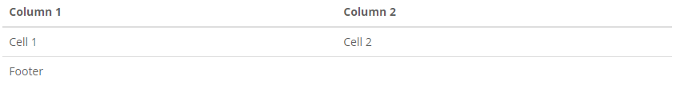
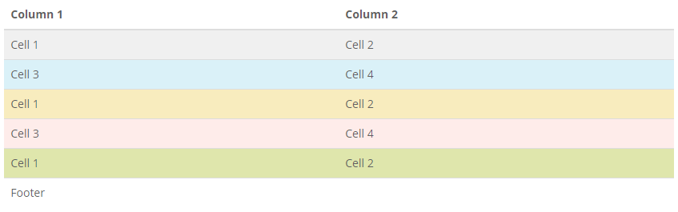
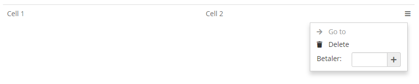
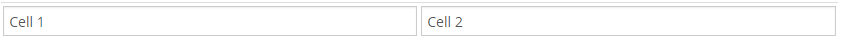
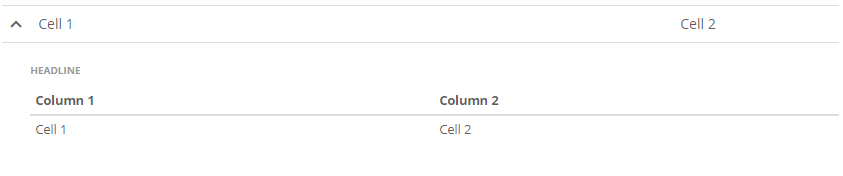

# Tables

## Basic tables

A table is always wrapped in `<div class="table-responsive"> ... </div>` The table element must have the class `table`.



```markup
<div class="table-responsive">
    <table class="table">
        <thead>
            <tr>
                <th>Column 1</th>
                <th>Column 2</th>
            </tr>
        </thead>
        <tfoot>
            <tr>
                <td colspan="2">Footer</td>
            </tr>
        </tfoot>
        <tbody>
            <tr>
                <td>Cell 1</td>
                <td>Cell 2</td>
            </tr>
        </tbody>
    </table>
</div>
```

## Table rows

You can enrich the table by adding additional classes.



```markup
<div class="table-responsive">
    <table class="table table-hover">
            <thead>
                <tr>
                    <th>Column 1</th>
                    <th>Column 2</th>
                </tr>
            </thead>
            <tfoot>
                <tr>
                    <td colspan="2">Footer</td>
                </tr>
            </tfoot>
            <tbody>
                <tr class="active">
                    <td>Cell 1</td>
                    <td>Cell 2</td>
                </tr>
                <tr class="info">
                    <td>Cell 3</td>
                    <td>Cell 4</td>
                </tr>
                <tr class="warning">
                    <td>Cell 1</td>
                    <td>Cell 2</td>
                </tr>
                <tr class="danger">
                    <td>Cell 3</td>
                    <td>Cell 4</td>
                </tr>
                <tr class="success">
                    <td>Cell 1</td>
                    <td>Cell 2</td>
                </tr>
            </tbody>
    </table>
</div>
```

## Context menu

Each row can have a context menu.



```markup
<div class="table-responsive">
    <table class="table">
            <tbody>
                <tr>
                    <td>Cell 1</td>
                    <td>Cell 2</td>
                    <td class="panel-table-button">
                        <a href="#" class="dropdown-toggle" data-toggle="dropdown"><i class="icon-options"></i></a>
                        <ul class="dropdown-menu dropdown-menu-right">
                            <li class="disabled"><a href="#" class="disabled"><i class="icon-forward"></i> Go to</a></li>
                            <li><a href="#"><i class="icon-delete"></i> Delete</a></li>
                            <li class="dropdown-function">
                                <div class="dropdown-form">
                                    <label class="control-label">Betaler:</label>
                                    <div class="form-group input-icon-group">
                                        <div class="input-group">
                                            <input class="form-control input-sm">
                                            <a href="#" class="input-group-addon">
                                                <i class="icon-plus"></i>
                                            </a>
                                        </div>
                                    </div>
                                </div>
                            </li>
                        </ul>
                    </td>
                </tr>
            </tbody>
    </table>
</div>
```

## Editible data

Edit data in table.



```markup
<div class="table-responsive">
    <table class="table">
            <tbody>
                <tr class="table-edit-mode">
                    <td class="cell-edit-mode">
                        <div class="form-group">
                            <input type="text" value="Cell 1" class="form-control">
                        </div>
                    </td>
                    <td class="cell-edit-mode">
                        <div class="form-group">
                            <input type="text" value="Cell 2" class="form-control">
                        </div>
                    </td>
                </tr>
            </tbody>
    </table>
</div>
```

## Expand rows



```markup
<div class="table-responsive">
    <table class="table">
        <colgroup>
            <col style="width: 1%;">
            <col style="width: auto;">
            <col style="width: 20%;">
        </colgroup>
        <tbody>
            <tr>
                <td>
                    <button class="btn-unstyled"><i class="icon-chevron-down"></i></button>
                </td>
                <td>Cell 1</td>
                <td>Cell 2</td>
            </tr>
            <tr class="table-row-expand">
                <td></td>
                <td colspan="2" class="no-padding">
                    <p class="mini-headline">Headline</p>
                    <div class="table-responsive">
                        <table class="table table-condensed">
                            <thead>
                                <tr>
                                    <th>Column 1</th>
                                    <th>Column 2</th>
                                </tr>
                            </thead>
                            <tbody>
                                <tr>
                                    <td>Cell 1</td>
                                    <td>Cell 2</td>
                                </tr>
                            </tbody>
                        </table>
                    </div>
                </td>
            </tr>
        </tbody>
    </table>
</div>
```


